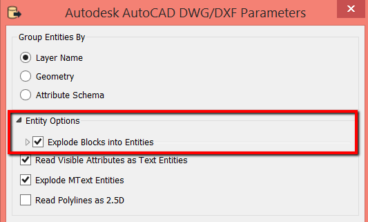
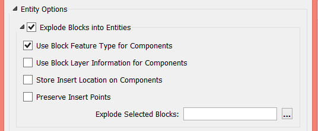
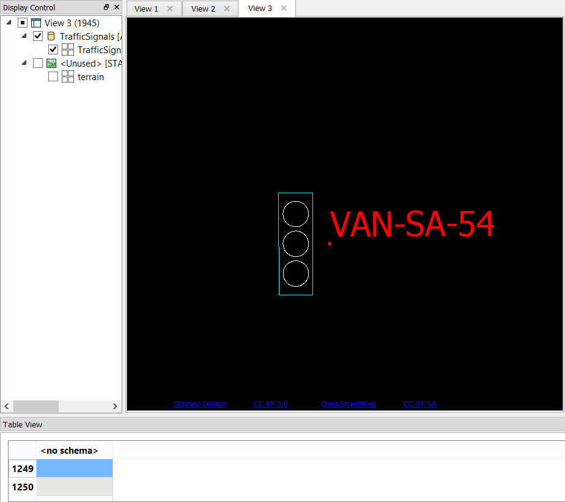
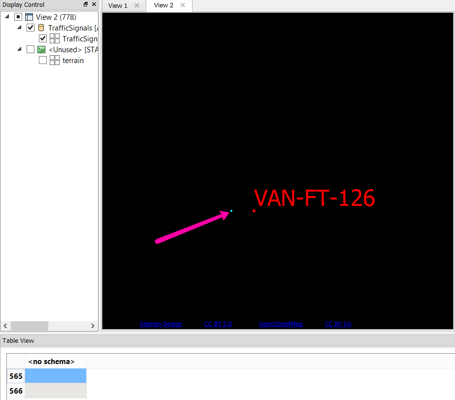

Introduction
============

How your AutoCAD drawing file is interpreted by FME is largely dependent
on which reader parameters are selected.

The common ways that we choose to read an AutoCAD drawing file is based
on:

-   how we want to group our entities (see [Viewing and Inspecting
    AutoCAD Data: Grouping
    Entities](https://knowledge.safe.com/articles/22435/getting-started-with-autocad-and-fme-reader-parame.html)
    ) and
-   whether or not we want to explode blocks.

In this article we\'ll examine how we can explode blocks. Specifically,
we\'ll take a look at the **Explode Blocks into Entities** reader
parameter.

Downloads
=========

[trafficsignals.zip](https://knowledge.safe.com/storage/attachments/2440-trafficsignals.zip)

Source Data
===========

The data used in this tutorial originates from open data made available
by the [City of Vancouver](http://data.vancouver.ca/) , British
Columbia. It contains information licensed under the Open Government
License - Vancouver.

Exploding Block Entities
========================

Exploding blocks means that the block will be exploded into its
component entities such as text, lines, points and so on. This is useful
for when you want to represent your block in FME as it would be seen in
AutoCAD, for example, if you wanted to translate a DWG to PDF.

**1) Start Data Inspector and Open Dataset**

Open the FME Data Inspector and select the Open Data Set icon, or use
the File \> Open Dataset menu option

In the Open Dataset dialog, select AutoCAD DWG/DXF for the format and
select the trafficsignals.dwg file as the dataset.

**2) Set Reader Parameters**

Click on the Parameters button.

For **Entity Options** , check the **Explode Blocks into Entities**
option.

In the reader parameters for adding a DWG reader, you will see that
there is a whole section devoted to \'Entity Options\'. This section
controls how certain entities are going to be handled as they are read
by FME. The very first option available is \'Explode Blocks into
Entities\':

After checking this parameter, if you click on the arrow next to this
field you will see additional related options when the menu expands:

These additional menu options allow you to select where you want these
component entities to be stored.

Click OK to dismiss the Reader Parameters, then OK again.

**3) Examine block.**

Zoom into a single traffic light. The exploded blocks are in white. You
may need to change the background color to black to see them more
clearly (from the View \> Background Color menu).

*Exploded Block: Note that the block appears as it was originally drawn
in AutoCAD, but the individual parts can be selected. That is because
the block is no longer a single entity.*

Preserving (Not Exploding) Block Entities
=========================================

By **not** exploding block entities we are preserving the insert
location of the block (where it was placed in the model). If you are not
concerned with maintaining the appearance of the block as it looked in
AutoCAD, but rather want to retain a discrete entity with associated
attributes (such as converting the AutoCAD blocks to points in an Esri
Shapefile), then this is a great option.

You can do this by repeating the steps from the section above, but
ensuring that 'Explode Blocks into Entities' is not checked.

*Unexploded block: By NOT checking the reader parameter option Explode
Blocks into Entities, the block is represented as a single point in
FME.*

