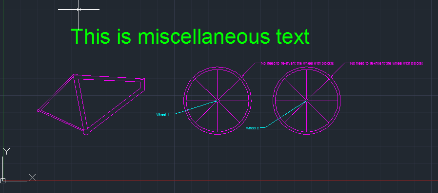
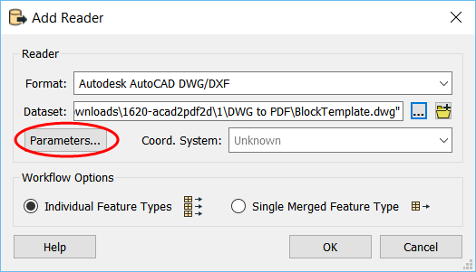
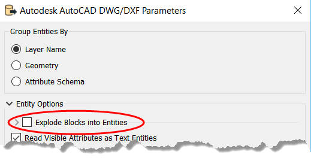
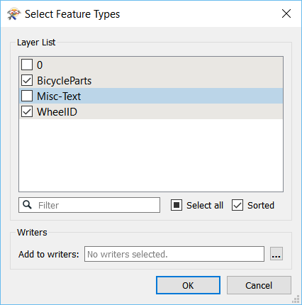
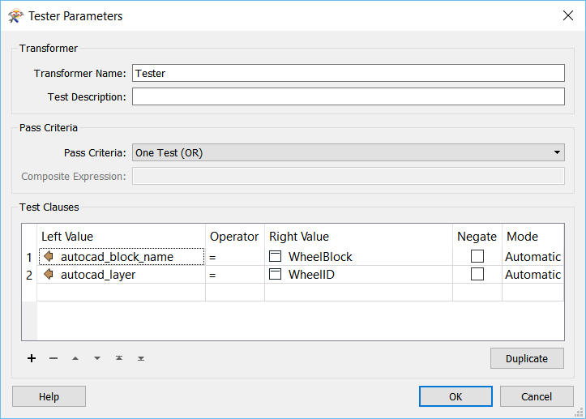
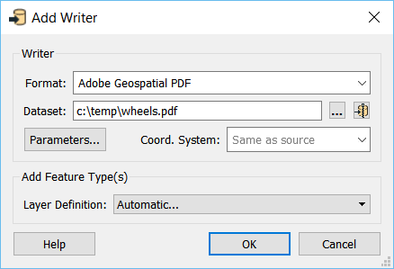
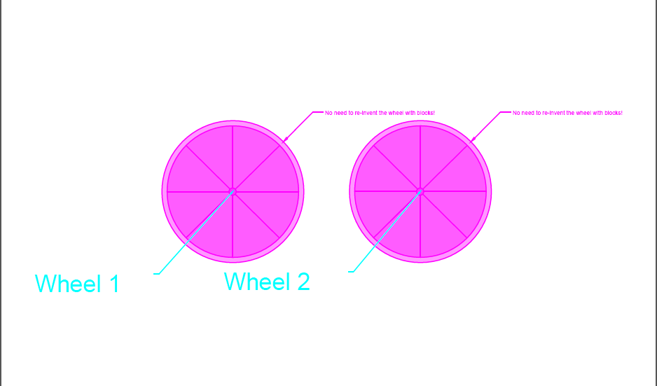

Introduction
============

The goal of this exercise is to demonstrate how to work with exploded
blocks in FME. Specifically, we will look at translating a DWG file into
a PDF.

Downloads
=========

-   [BlockTemplate.dwg](https://knowledge.safe.com/storage/attachments/15806-blocktemplate.dwg)
-   [acad2pdf2d-begin.fmwt](https://knowledge.safe.com/storage/attachments/15804-acad2pdf2d-begin.fmwt)
-   [acad2pdf2d-complete.fmwt](https://knowledge.safe.com/storage/attachments/15805-acad2pdf2d-complete.fmwt){#15805}

Source Data
===========

In the image below, we see a DWG file containing two blocks with text
saved in a separate layer. In this example, we will only be looking at
one block to serve as a simple case demonstrating how to write blocks to
a PDF.

Next to the the wheel blocks are text labels indicating an ID for the
wheel. This is not contained within the block, but rather it is stored
on the BicycleParts layer.

*BlockTemplate.dwg*

Step-by-Step Instructions

**1) Open FME Workbench. Start with a blank workspace.**

In Windows this is found under Start \> All Programs \> FME Desktop \>
FME Workbench. You can click New under the Start tab (or press Ctrl + N)
and select Blank Workspace to create a new blank workspace.

**2) Add AutoCAD DWG/DXF reader.**

From the Readers menu, select Add Reader. Fill in the reader and dataset
parameters, using BlockTemplate.dwg as your Dataset. Then, click the
Parameters button:

In the Parameters dialog, ensure that 'Group Entities By' is set to
'Layer Name' and the 'Explode Blocks into Entities' option is checked.
This will explode the block into its constituent features (in this case,
ellipses and polygons) so it will be displayed in the PDF just like it
is in AutoCAD.

Click OK, then OK again.

**3) Select Feature Types**

When prompted to select layers to read, you will only need to select the
layer that contains the blocks and the layer that contains the text you
are interested in. The layer containing the block we want is on a layer
named 'BicycleParts', and the layer containing the text we want is named
\'WheelID\'. Only check these layers to be added to the canvas.

**4) Expose format attributes**

Once the reader is added to the canvas, the next step is to extract the
block we are interested in. To do this, we first need to expose two
format attributes.

Click the BicycleParts reader feature type to open its properties in the
Parameter Editor window. Click on the Format Attributes tab. Check
autocad\_block\_name. Click Apply.

Next, open the properties of the WheelID reader feature type. Click on
the Format Attributes tab. Check autocad\_layer. Click Apply

**5) Add Tester**

Add a Tester to extract only the block we want from BicycleParts, and
also the text which is contained in a separate layer (WheelID). Connect
both of the reader feature types to the tester.

We know that our block name is WheelBlock, after examining the data in
AutoCAD or in the FME Data Inspector. Within the Tester transformer
parameters, we want to test if the format attribute autocad\_block\_name
= WheelBlock, or if autocad\_layer = WheelID.

**6) Add Writer**

From the Writers menu, select Add Writer.

Add a writer to your canvas in the Adobe Geospatial PDF format (PDF2D).
Name the output layer something meaningful. Change the Layer Definition
to Automatic.

**7) Run workspace**

Run the workspace and check out the results. You will find a PDF in the
output directory you chose in step 6 showing the block of interest:

Of course, you could use the DWGStyler transformer to modify the colour
of the block as well! Additionally, new for 2018.0 betas: you can read
the PDF into a workspace using the new PDF reader.

