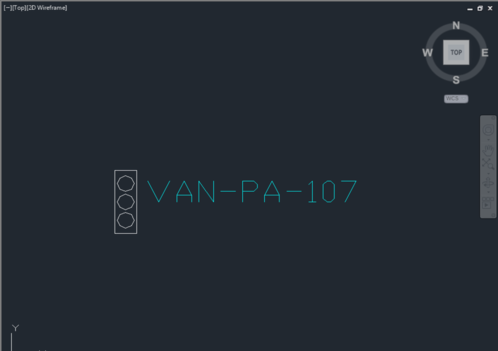
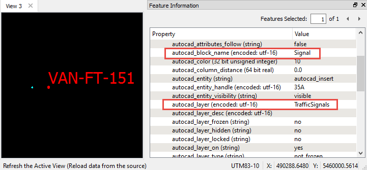
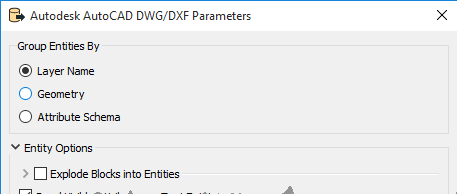
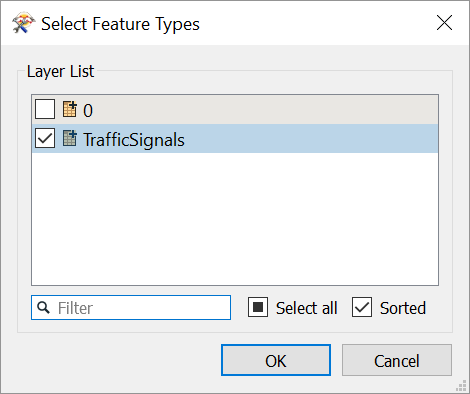

Introduction
============

In this tutorial we will translate a DWG file representing traffic
signals to Esri shapefile (SHP). The signals are stored as blocks in the
DWG file, and there is a text entity which holds the signal ID. Our goal
is to:

-   translate the block in insertion point into a single point in our
    output shapefile, and
-   move the signal ID into an attribute of the point.

This transformation highlights one way to work with AutoCAD block
entities in FME: not exploding blocks (preserving their insertion
points) works well when translating to a format that does not store such
complex entities, or require single geometries in the output.

Downloads
=========

-   [trafficsignals.zip](https://knowledge.safe.com/storage/attachments/15813-trafficsignals.zip){#15813}
-   [preserveblocks-begin.fmwt](https://knowledge.safe.com/storage/attachments/15811-preserveblocks-begin.fmwt){#15811}
-   [preserveblocks-complete.fmwt](https://knowledge.safe.com/storage/attachments/15812-preserveblocks-complete.fmwt){#15812}

Source Data
===========

The data used in this tutorial originates from open data made available
by the [City of Vancouver](http://data.vancouver.ca/) , British
Columbia. It contains information licensed under the Open Government
License - Vancouver.

In the image below, we see an example of one of the traffic signals in
this DWG file. The traffic signal is stored as a block.

In addition to this block there is a text label indicating an ID for the
signal. This is not contained within the block, but rather it is stored
on the TrafficSignals layer along with our block.

Let's see how FME handles this data by looking at the DWG file in the
FME Data Inspector, with the reader parameter **Explode Blocks into
Entities** unchecked:

FME has read the \'insert point\' of the blocks, which represents the
location of the block (in blue). Note that the red point represents the
text insertion point, which is different. The blue insert point is what
will be translated to the SHP file. The text representing the signal
id\'s is also stored on the TrafficSignals layer, and is moved onto the
insert point using a NeighborFinder transformer.

Step-by-Step Instructions
=========================

**1) Start Workbench and add an AutoCAD DWG/DXF Reader to a blank
workspace.**

In the Add Reader dialogue, select AutoCAD DWG/DXF for the reader, and
the trafficsignals.dwg file for the dataset.

Click on the Parameters button.

Ensure 'Group Entities By' is set to 'Layer Name'.

We want to keep the block preserved as one single entity (point), so do
not explode the blocks in the reader parameters:

Click OK twice.

We only need the TrafficSignals feature type, so deselect the '0'
feature type in the Select Feature Types dialog.

**2) Expose autocad\_text\_string**

Open TrafficSignals reader feature type in the Parameter Editor window
by clicking on it. Click on the Format Attributes tab. Check
autocad\_text\_string. Click Apply. We will work with this attribute
later.

**3) Add GeometryFilter**

Open the GeometryFilter transformer in the Parameter Editor window by
clicking on it. Separate the points (which represent block insertion
points) from the text (which represents Signal ID\'s) by selecting
'Points' and 'Text' under 'Geometry Types to Filter'. This prepares the
data for the NeighborFinder.

**4) Add NeighborFinder**

Connect the points from the GeometryFilter to the Base port of the
NeighborFinder. Connect the text output from the GeometryFilter to the
Candidate port.

Open the NeighborFinder transformer in the Parameter Editor window by
clicking on it. Set the Maximum Distance to 5 (use the Measure tool in
the Data Inspector to confirm this is a good number to use). Click
Apply.

**5) Add AttributeRenamer**

Rename autocad\_text\_string to SignalID.

**6) Add an Esri Shapefile writer**

From the Writers menu, select Add Writer.

Add an Esri Shapefile writer. Select a location for the dataset. At the
Shapefile Definition drop-down, select Manual. Click OK.

**7) Connect the output port from the AttributeRenamer to the writer**

Open the writer parameters dialog. Select the 'User Attributes' tab. Add
the attribute that you created in the AttributeRenamer (SignalID). Click
Apply.

**8) Run the workspace, and inspect the output data**

You will now see single points that have the text label as an attribute
in the attribute table.

*DWG text label as an SHP attribute in Data Inspector.*

